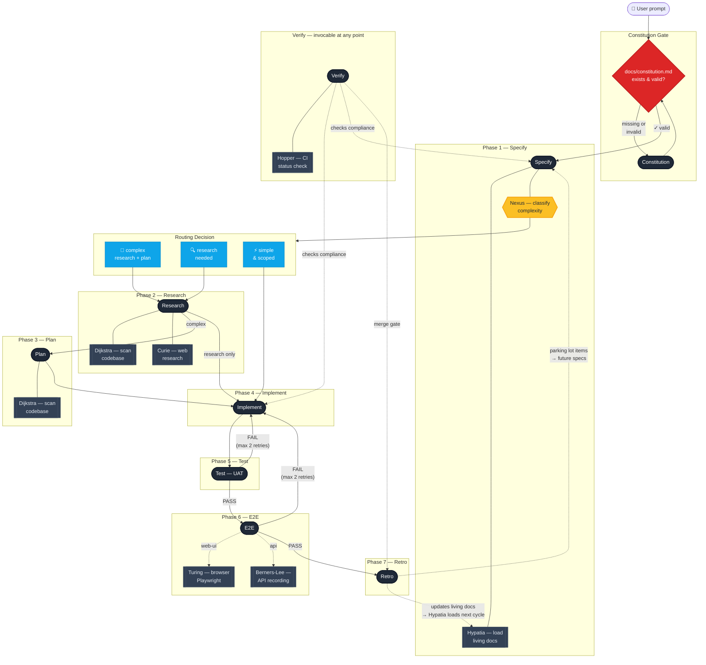
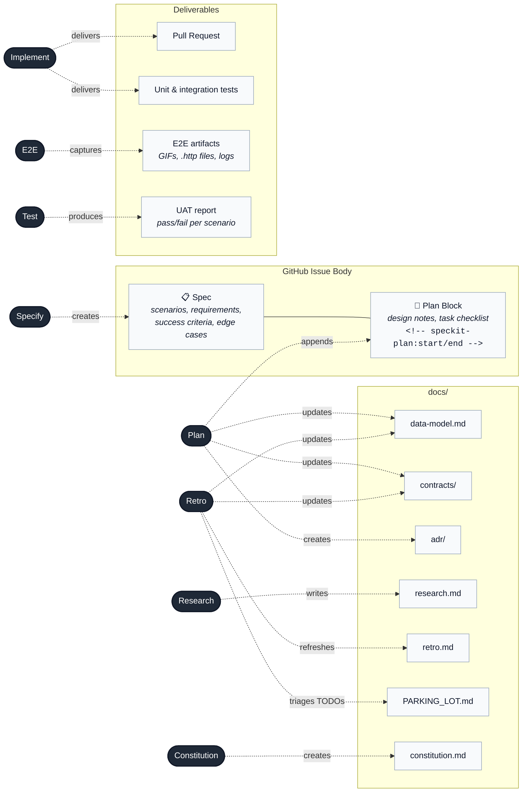
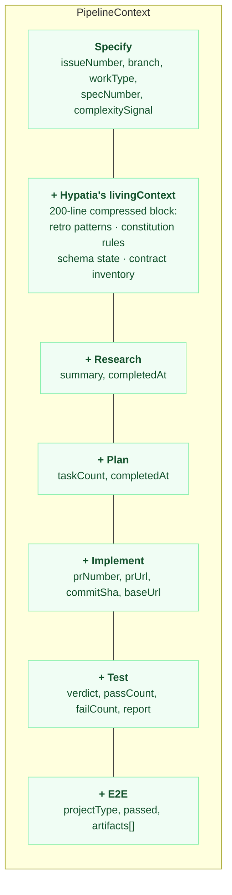
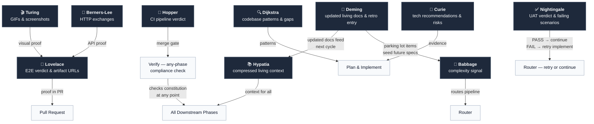

# Speckit

Spec-driven development pipeline for AI-assisted coding agents.

## What is Speckit?

Speckit is a coordinated system of [Agent Skills](https://agentskills.io/) and subagents that turn a one-line idea into a shipped, tested, documented feature — without you babysitting the AI.

You describe what to build. Speckit writes a structured spec, creates a GitHub Issue, classifies the complexity, routes through the right phases (research, plan, implement, test, e2e), and runs a retrospective that feeds learnings back into your project's living documentation.

**Core principles:**

- **Spec-driven, not AI-driven** — humans define _what_ to build; the pipeline decides _how_ to execute it
- **Living docs vs transient specs** — living documents (`docs/`) persist in the repo and evolve across cycles; specs are transient GitHub Issues that drive a single feature, then close. The repo remembers patterns, schemas, and decisions; issues capture the work-in-flight
- **Auto-continuation** — the full pipeline runs without pausing to ask which step to take next
- **Constitution-gated** — no work starts without project governance in place
- **Right-sized artifacts** — only generate docs, schemas, and research when complexity demands it
- **Issue-backed accountability** — one GitHub Issue per feature, full lifecycle tracked in the issue body

## Pipeline Overview



**Legend:** <span style="display:inline-block;width:12px;height:12px;background:#1f2937;border-radius:50%;"></span> Pipeline phase &nbsp; <span style="display:inline-block;width:12px;height:12px;background:#fbbf24;border-radius:4px;"></span> Decision node &nbsp; <span style="display:inline-block;width:12px;height:12px;background:#334155;border-radius:3px;"></span> Subagent &nbsp; <span style="display:inline-block;width:12px;height:12px;background:#0ea5e9;border-radius:3px;"></span> Route option &nbsp; <span style="display:inline-block;width:12px;height:12px;background:#dc2626;border-radius:4px;"></span> Gate &nbsp; Solid lines = execution flow &nbsp; Dashed lines = feedback / cross-cutting

### Three paths through the pipeline

| Complexity | Path | When |
|------------|------|------|
| **Complex** | Specify → Research → Plan → Implement → Test → E2E → Retro | Schema changes, new APIs, unfamiliar domain |
| **Research needed** | Specify → Research → Implement → Test → E2E → Retro | Library selection, tech unknowns, no architecture changes |
| **Simple** | Specify → Implement → Test → E2E → Retro | Clear scope, no design decisions |

The **Nexus** subagent classifies complexity during Specify and sets a `complexitySignal` (`research`, `plan`, or `implement`) that the router uses to pick the right path.

## Artifact Flow

Each phase produces or updates specific artifacts. The pipeline keeps the **issue-backed spec** and **living documents** separate on purpose.



**Legend:** Dark nodes = pipeline phases &nbsp; Light nodes = artifacts &nbsp; **GitHub Issue Body** = transient (per-feature, closes on merge) &nbsp; **docs/** = living (persists across cycles, evolves) &nbsp; **Deliverables** = shipped output

**Living vs Transient:**

| | Living Documents | Transient Specs |
|---|---|---|
| **Where** | `docs/` — committed to the repo | GitHub Issue body |
| **Lifespan** | Persist and evolve across many cycles | Created per feature, close when PR merges |
| **Updated by** | Plan and Retro only | Specify (create), Plan (append), Implement (tick tasks) |
| **Examples** | `data-model.md`, `contracts/`, `retro.md`, `constitution.md`, `PARKING_LOT.md` | Issue #42 spec + plan block |
| **Purpose** | Institutional memory — the repo remembers | Work-in-flight — drives a single feature |

**Rules:**

- The issue body is the canonical spec. **Specify** writes the top; **Plan** appends below it. Neither replaces the other.
- Living docs live in `docs/` — updated only by **Plan** and **Retro**.
- No `specs/` directory. No local `spec.md` files. No per-feature doc folders.
- Artifacts are right-sized: `data-model.md` is only created when schemas change, `contracts/` only when APIs change, ADRs only for significant decisions.

## Skills

User-invocable skills triggered via slash commands in VS Code:

| Skill | Slash Command | Description |
|-------|---------------|-------------|
| speckit | `/speckit` | Pipeline router — checks constitution, classifies complexity, routes to the right phase |
| speckit-specify | `/speckit-specify` | Write a structured spec (scenarios, requirements, success criteria) and create a GitHub Issue |
| speckit-research | `/speckit-research` | Investigate technologies, compare libraries, assess patterns — writes to `docs/research.md` |
| speckit-plan | `/speckit-plan` | Design architecture, append design notes and task checklist to the issue body, update living docs |
| speckit-implement | `/speckit-implement` | Execute task checklist, code, test, commit, push, create PR (auto-closes issue via `Closes #N`) |
| speckit-constitution | `/speckit-constitution` | Create or update project governance in `docs/constitution.md` with MUST/SHOULD/NON-NEGOTIABLE rules |
| speckit-verify | `/speckit-verify` | Check compliance against constitution rules, test patterns, naming conventions, CI status |

## The Agents — A Coordinated Ensemble

Speckit is not a chain of isolated scripts. It's a **persona-driven agency** — ten agents, each named after a pioneer whose philosophy shapes how they think and what they contribute to the shared context.

Every agent follows the [Subagent Autonomy Protocol](references/AGENT-PROTOCOL.md): **never ask the user**, resolve what you can with tools, escalate only via structured partial results. Token buckets cap re-invocations to prevent deadlocks.

### Babbage — _The Analyst_ (speckit-nexus)

> _"Get the problem right, and implementation follows logically."_

Named after Charles Babbage, father of programmatic computation. Babbage is the pipeline's first thinker — invoked during **Specify** to classify the work before anyone builds. She dissects the user's description into a structured pre-analysis: work type, core problem, actors, constraints, edge cases, and a **complexity signal** (`research` / `plan` / `implement`) that routes the entire pipeline. Bucket: **2**.

### Hypatia — _The Context Librarian_ (speckit-living-docs-loader)

> _"Large context is noise. I extract signal."_

Named after Hypatia of Alexandria, legendary knowledge synthesizer. Hypatia despises verbosity. She loads `retro.md`, `constitution.md`, `data-model.md`, and `contracts/` then distills them into a single **200-line compressed block** — the last 5 retro entries as actionable patterns, constitution principles as numbered rules, schema state as entity tables. Every downstream agent receives only what matters. Bucket: **1** — if docs don't exist, they don't exist.

### Dijkstra — _The Code Archaeologist_ (speckit-codebase-scanner)

> _"Patterns exist for a reason. Find them. Respect them."_

Named after Edsger Dijkstra, systematic algorithm pioneer. Dijkstra believes features succeed when they fit existing patterns. He scans for schemas, routes, auth patterns, type definitions, test infrastructure, and naming conventions — then returns per-question structured answers (finding, relevant files, patterns to follow, gaps). Invoked by **Research** and **Plan**. Bucket: **2**.

### Curie — _The Empiricist_ (speckit-web-researcher)

> _"Evidence beats hype. Measure everything."_

Named after Marie Curie, rigorous empiricist. Curie evaluates libraries on measurable signals: maintenance frequency, weekly downloads, bundle size, TypeScript support, security advisories. She flags red flags explicitly (stale packages, <1000 weekly downloads, 6+ months without update) and presents options with weights — never dictates. Invoked by **Research**. Bucket: **3**.

### Nightingale — _The Verifier_ (speckit-test)

> _"Spec is truth. Implementation proves truth."_

Named after Florence Nightingale, pioneer of evidence-based practice. Nightingale's obsession is testable proof. Every acceptance scenario, functional requirement, success criterion, and edge case must be verifiable in code or test runs. Acceptance scenarios are the primary gate; she doesn't soften on constitution violations — NON-NEGOTIABLE rules are hard stops. Produces a structured **UAT report** with per-item pass/fail tables. Bucket: **2**.

### Lovelace — _The E2E Orchestrator_ (speckit-e2e)

> _"Synthesis of evidence is proof. Show, don't tell."_

Named after Ada Lovelace, first programmer and computational synthesizer. Lovelace recognizes that different projects need different evidence. She detects the project type (`web-ui` / `api` / `cli` / `library` / `infrastructure`), delegates to the right specialist — **Turing** for browsers, **Berners-Lee** for APIs — then synthesizes all evidence into PR comments with raw GitHub URLs. Bucket: **2**.

### Turing — _The UI Choreographer_ (speckit-e2e-browser)

> _"If users can't see it work, it didn't work."_

Named after Alan Turing, pioneer of machine testing. Turing converts user scenarios into Playwright test choreography. He records video, converts to compact GIFs (8fps, 640px, <5MB), pushes assets to an orphan `e2e-assets` branch, and embeds proof directly in the PR. If tests fail, he reports exact error messages so implementers know precisely what to fix. Bucket: **3**.

### Berners-Lee — _The HTTP Diplomat_ (speckit-e2e-api)

> _"Every request/response pair is a contract. Verify it."_

Named after Tim Berners-Lee, inventor of the Web. Berners-Lee speaks HTTP fluently. He creates `.http` request files, executes them via curl, captures full exchanges (headers + body), and produces structured proof tables. For API projects, he's the acceptance test runner who demonstrates every scenario with real HTTP exchanges. Bucket: **3**.

### Hopper — _The CI Sentinel_ (speckit-pipeline-checker)

> _"Green pipeline gates shipping."_

Named after Grace Hopper, debugging visionary. Hopper is the gatekeeper. Before code ships, the CI pipeline must be green. She classifies outcomes rigidly: all green → ship, red → fix, pending → wait, stale → flag for re-trigger. Invoked by **Verify**. Bucket: **2**.

### Deming — _The Reflectionist_ (speckit-retro)

> _"End every cycle smarter than you started."_

Named after W. Edwards Deming, pioneer of continuous improvement. Deming closes the learning loop. She compares changed files against documented schemas and APIs, updates living docs when they've drifted, scans for `TODO(speckit):` markers and triages them to `PARKING_LOT.md`, audits for stale docs, and appends a retro entry so the **next** cycle knows what this one learned. Bucket: **1**.

## Focused Context — How the Agents Share What Matters

The essence of Speckit is **focused context**: every agent receives exactly what it needs — no more, no less. Context flows through two mechanisms working in concert.

### 1. PipelineContext — The Accumulating Handoff

A JSON object built incrementally as the pipeline progresses. Each phase enriches it; downstream phases inherit everything upstream learned. No re-discovery, no re-scanning.



A **circuit breaker** tracks `retryCount` per phase — if any phase fails twice, the pipeline stops and escalates to the user instead of looping.

See [HANDOFF-SCHEMA.md](references/HANDOFF-SCHEMA.md) for the full schema.

### 2. Hypatia's Compression — The Context Membrane

Raw living docs can be thousands of lines. Hypatia compresses them into a **single 200-line block** that every downstream agent receives. This is the pipeline's shared memory:

| Source Document | What Hypatia Extracts | Who Consumes It |
|-----------------|----------------------|-----------------|
| `docs/retro.md` | Last 5 entries as actionable patterns | All phases — avoids repeating past mistakes |
| `docs/constitution.md` | All MUST/SHOULD/NON-NEGOTIABLE principles as numbered rules | Specify (compliance gate), Verify, Test |
| `docs/data-model.md` | Entity summary + recent changelog entries | Plan, Implement, Retro |
| `docs/contracts/*.md` | Status (draft/ratified), endpoint inventory | Plan, Implement, Retro |

Deming (Retro) closes the loop — she updates these same documents at the end of every cycle, which Hypatia will compress for the _next_ cycle. The pipeline learns.

### 3. What Each Agent Contributes Downstream



**Legend:** Dark nodes = agents (each named after a pioneer) &nbsp; Light nodes = pipeline targets they feed into &nbsp; Arrows show what each agent contributes and who consumes it

> The installer links all agents into `.github/agents/` for automatic discovery. No `settings.json` changes needed.

### The Learning Loop

Speckit is cyclical by design. The end of one cycle primes the next:

1. **Deming** (Retro) updates `docs/retro.md`, `data-model.md`, `contracts/`, and triages TODOs to `PARKING_LOT.md`
2. **Hypatia** (Living Docs Loader) compresses those updated docs into a focused context block for the **next** `speckit-specify` invocation
3. **Babbage** (Nexus) uses that compressed context — retro patterns, constitution rules, schema state — to classify the next piece of work more accurately
4. Parking lot items from the previous cycle become candidates for future specs

Every cycle makes the pipeline smarter: past mistakes surface as retro patterns, schema drift gets corrected, and discovered TODOs feed future work.

## Constitution & Governance

Every pipeline run starts with a **constitution gate**: if `docs/constitution.md` is missing or has unfilled template placeholders, the router redirects to `speckit-constitution` before any work begins.

The constitution contains principles marked as:

| Severity | Meaning |
|----------|---------|
| **NON-NEGOTIABLE** | Blocks the pipeline — zero tolerance |
| **MUST** | Required — violations are errors |
| **SHOULD** | Recommended — violations are warnings |

`speckit-verify` extracts these rules and checks compliance across code, tests, commits, naming, and CI status.

## Extension Hooks

Speckit supports lifecycle hooks via `.specify/extensions.yml` in the project root. Each skill checks for hooks at `before_` and `after_` lifecycle points (e.g., `hooks.before_specify`, `hooks.after_implement`).

```yaml
# .specify/extensions.yml
hooks:
  before_specify:
    - extension: "my-linter"
      command: "run-lint"
      optional: true
  after_implement:
    - extension: "my-notifier"
      command: "notify-team"
      optional: false
```

See [HOOKS.md](references/HOOKS.md) for the full hook execution procedure.

## Installation

### Quick install (recommended)

```powershell
# From the root of your project:
& ([scriptblock]::Create((Invoke-RestMethod https://raw.githubusercontent.com/ranvirsingh/speckit/main/install.ps1)))
```

This downloads the latest release zip, extracts it to `.github/skills/speckit/`, and links everything for VS Code discovery.

### Manual install

```bash
# 1. Download the latest release zip from GitHub
# 2. Extract to .github/skills/speckit/
# 3. Run the installer
powershell -ExecutionPolicy Bypass -File .github/skills/speckit/install.ps1
```

### Updating

```powershell
# Re-run the installer — it auto-updates from GitHub and overwrites by default
powershell -ExecutionPolicy Bypass -File .github/skills/speckit/install.ps1
```

The installer creates directory junctions (Windows) or symlinks (macOS/Linux) so VS Code discovers everything automatically:
- Sub-skills → `.github/skills/speckit-specify`, `speckit-plan`, etc.
- Subagents → `.github/agents/speckit-codebase-scanner`, `speckit-living-docs-loader`
- Updates `.gitignore` to exclude the generated links **and** `.github/skills/speckit/` itself

> **After cloning**: Since speckit is gitignored, each developer runs the install one-liner once after cloning the repo. The installer always pulls the latest release.

To uninstall: `powershell -ExecutionPolicy Bypass -File .github/skills/speckit/install.ps1 -Uninstall`

## Requirements

- VS Code with GitHub Copilot
- GitHub CLI (`gh`) for issue/PR management
- Git for version control

## License

Private repository. All rights reserved.
