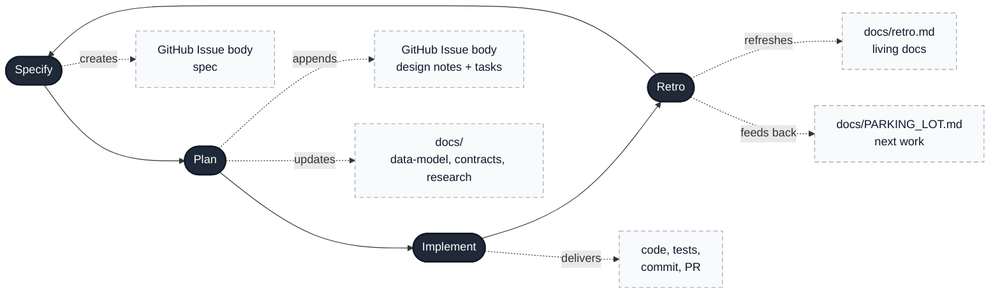

# Speckit

Spec-driven development pipeline for AI-assisted coding agents.

## What is Speckit?

A set of [Agent Skills](https://agentskills.io/) that implement a lightweight, right-sized development process:

1. **Specify** — Write an issue-backed spec, create a GitHub Issue
2. **Plan** — Design architecture, append the plan beneath the issue-backed spec, and update `docs/` living docs when complex
3. **Implement** — Code, test, commit, push, create PR
4. **Retro** — Update `docs/` living docs, triage TODOs

Plus a **Constitution** skill for setting up project governance.

## Installation

### As a Git submodule (recommended)

```bash
# Add as submodule at the standard skills location
git submodule add https://github.com/ranvirsingh/speckit.git .github/skills/speckit

# Configure VS Code to discover nested skills
# Add to .vscode/settings.json:
# "chat.agentSkillsLocations": { ".github/skills/speckit": true }
```

### Manual copy

```bash
# Copy the entire folder into your project
cp -r speckit/ your-project/.github/skills/speckit/
```

## VS Code Configuration

Add to `.vscode/settings.json` so VS Code discovers the nested sub-skills:

```json
{
  "chat.agentSkillsLocations": {
    ".github/skills/speckit": true
  }
}
```

## Skills

| Skill | Slash Command | Description |
|-------|---------------|-------------|
| speckit | `/speckit` | Pipeline router — routes to the appropriate sub-skill |
| speckit-specify | `/speckit-specify` | Write an issue-backed spec and create a GitHub Issue |
| speckit-plan | `/speckit-plan` | Append design notes and tasks beneath the spec, plus update living docs when needed |
| speckit-implement | `/speckit-implement` | Execute tasks, commit, push, create PR |
| speckit-retro | `/speckit-retro` | Post-implementation retrospective |
| speckit-constitution | `/speckit-constitution` | Project governance setup |

## Pipeline Flow

```
Complex work (schema/API/unfamiliar)?  specify → plan → implement → retro
Simple & scoped?                       specify → implement → retro
```

## Process Diagram



## Artifact Model

Speckit keeps the **issue-backed spec** and **living documents** separate on purpose:

- **GitHub Issue body** — the canonical spec/tracker created during **Specify**; **Plan** appends its design notes and task checklist beneath that spec in the same issue body
- **`docs/`** — living documents updated during **Plan** and **Retro** only

Issue body layout:

1. **Specify** writes the spec at the top of the issue body.
2. **Plan** appends a plan block below it (design notes + task checklist).
3. **Implement** and **Retro** update or read that appended plan block without replacing the original spec.

Issue comments may be used for supplementary discussion, but they are **not** the canonical plan source.
Downstream skills read the issue body.

Rules:

- Do **not** create a `specs/` directory.
- Do **not** create a local `spec.md` file.
- Do **not** create per-feature doc folders.
- Keep living documents in `docs/` (for example `docs/data-model.md`, `docs/contracts/`, `docs/retro.md`).

## Requirements

- VS Code with GitHub Copilot
- GitHub CLI (`gh`) for issue/PR management
- Git for version control

## License

Private repository. All rights reserved.
